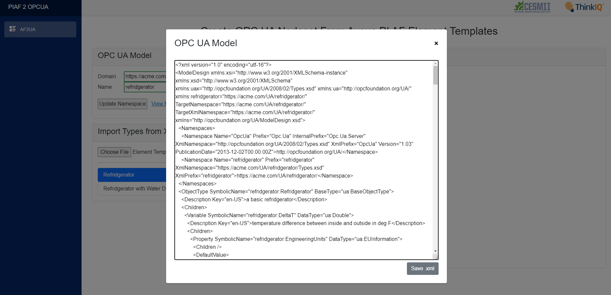

# Create OPC UA Nodesets From Aveva PI AF Element Templates

This project leverages XML interoperability standards to allow creation of OPC UA Information Models and Nodesets from Asset Framework (AF) Element Templates from AVEVA's PI System Explorer (PI AF). Reverse functionality, i.e. creation of PI AF Element Templates from OPC UA Information Models and Nodesets is not yet supported, but planned.


<p align = "center"><b>Fig.1 - Screenshot of UI to Import and Browse AF Element Templates</b></p>

First, we create a new UA Model by entering a domain and name. The program automatically references the typical basic OPC UA namespaces for us. For instance, "ht<span>tps://</span>acme.com/UA" and "refridgerators" will result in the following OPC UA design model:

``` xml
<?xml version="1.0" encoding="utf-16"?>
<ModelDesign xmlns:xsi="http://www.w3.org/2001/XMLSchema-instance" xmlns:xsd="http://www.w3.org/2001/XMLSchema" xmlns:uax="http://opcfoundation.org/UA/2008/02/Types.xsd" xmlns:ua="http://opcfoundation.org/UA/" xmlns:refridgerator="https://acme.com/refridgerator/" TargetNamespace="https://acme.com/refridgerator/" TargetXmlNamespace="https://acme.com/refridgerator/" xmlns="http://opcfoundation.org/UA/ModelDesign.xsd">
  <Namespaces>
    <Namespace Name="OpcUa" Prefix="Opc.Ua" InternalPrefix="Opc.Ua.Server" XmlNamespace="http://opcfoundation.org/UA/2008/02/Types.xsd" XmlPrefix="OpcUa" Version="1.03" PublicationDate="2013-12-02T00:00:00Z">http://opcfoundation.org/UA/</Namespace>
    <Namespace Name="refridgerator" Prefix="refridgerator" XmlNamespace="https://acme.com/refridgerator/Types.xsd" XmlPrefix="refridgerator">https://acme.com/refridgerator/</Namespace>
  </Namespaces>
</ModelDesign>
```

Once we load an XML file with AF element templates, we can add element templates as BasicObjectTypes to the OPC UA design model by using the "+" icons next to the element template names. Element templates can be removed from the model design the same way. At any time, we can preview and save the generated ModelDesign.xml text. We can also compile a Nodeset.xml - this action is performed on the server utilizing the OPC UA model compiler library.


<p align = "center"><b>Fig.2 - Preview and Save ModelDesign and Nodeset XML Files</b></p>

## Modeling Techniques Supported in PI AF 

PI AF offers 2 basic types of objects that models are based upon: elements and attributes, both of which can be nested. Elements can be based on types, Element Templates, which are stored in a model library’s “Element Templates” section. An Element Template can be based of a single other Element Template. This allows inheritance and chaining of dependencies.

Even though element instances can be nested, element templates can not be nested, i.e. it is not possible to create composite types. Within an element template, however, attribute templates can be nested. For the purpose of exporting AF element templates to OPC UA, we can either disregard nested attributes, or flatten them. Flattening nested attributes would preserve them for usage in the information model, but ultimately change the structure of the type, and possibly create issues with unique naming of sibling attributes.

## OPC UA Information Model Assumptions

We add objects into a newly created namespace. At this time we don't support appending or editing of existing Information Models or Nodesets. Our workflow builds an OPC UA model first (ModelDesign.xsd), and then compiles a Nodeset off it using the OPC UA model compiler.

Only few basic features of the rich set of OPC UA object types and namespaces are used to effectively campture AF Element Templates:

- Element Templates are modeled as BaseObjectType.
- Element Templates that are based on another Element Template are modeled the same way. It is thus required to "work your way up", Templates are only allowed to be added to an Information Model once the dependency exists.
- Attribute Templates are modeled either as variables or as properties.
- Time series attributes and attributes that are numeric are modeled as variables, so engineering units can be attached.
- Engineering Units are captured in a property called "EngineeringUnits" based on the EUInformation type, that leverages the UNICE library of engineering units. If the DefaultUoM doesn't match, we show an exception message.
- Since AF does not allow nested element types, it is not possible to create complex types that encapsulate nameplate metadata such as the MachineIdentificationType.
- The modeling rule of all properties and variables is set to its default state, which is "mandatory". 

## Element Template Meta-Data

- Name - is captured.
- Description - is captured.
- Base Template - is captured.
- Type - only Elements are considered.
- Categories - omitted. This is AF specific.
- Default Attribute - omitted. This is AF specific.
- Naming Pattern - omitted. This does not exist in the SMIP.

## Attribute Template Meta-Data

- Name - is captured.
- Description - is captured.
- Properties - omitted. This is AF specific.
- Categories - omitted. This is AF specific.
- Default UoM - is captured and validated against OPC UA engineering units.
- Default Value - is captured.
- Display Digits - omitted. This is AF specific.
- Data Reference - only <none> (for static attributes) and PI Point (for tags) are captured.

### Value Type Mapping

Only basic types are captured. We omit array types, enums, and AF object references. 

AF types are mapped to SMIP types as follows:

- Boolean - bool
- Byte, Int16, Int32, Int64 - integer
- Single, Double - float
- String - string
- GUID - string
- DateTime - DateTime


