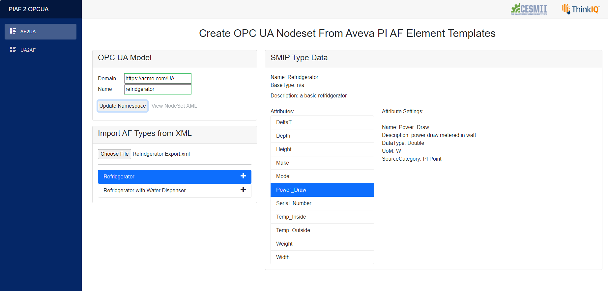
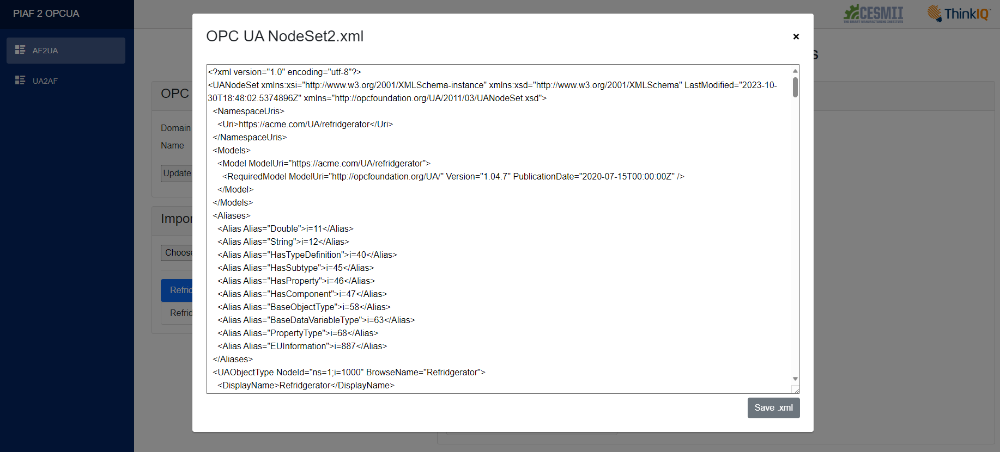
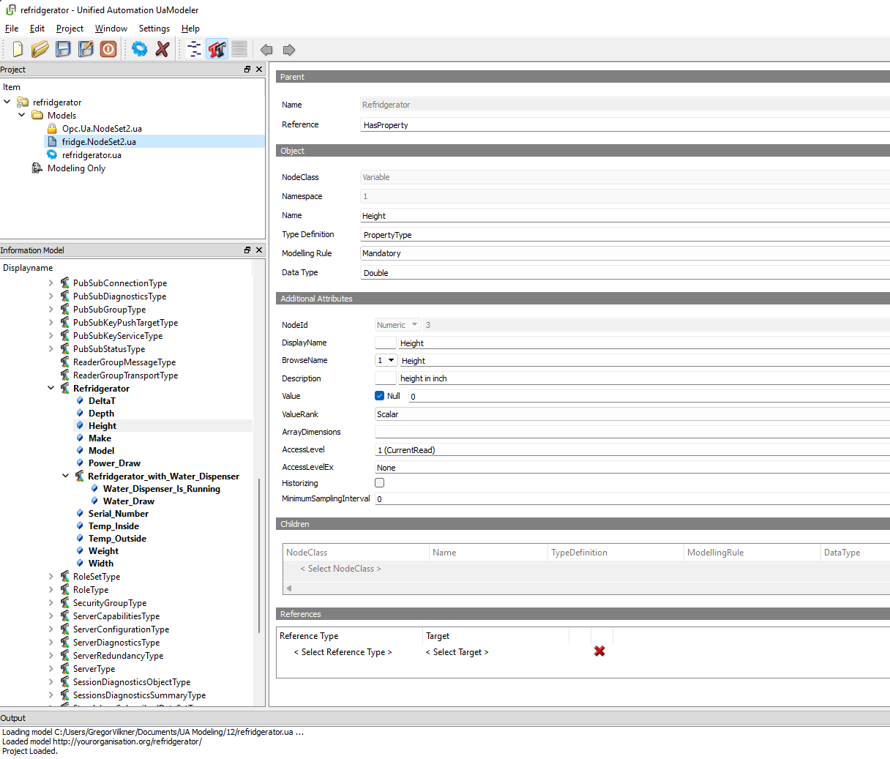
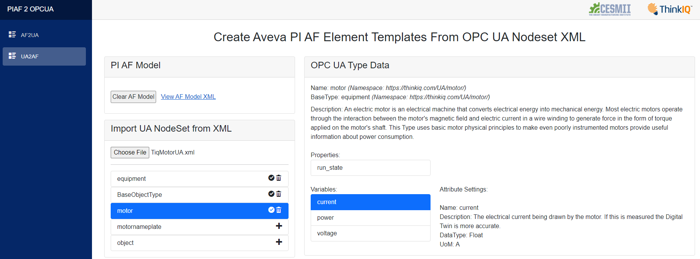
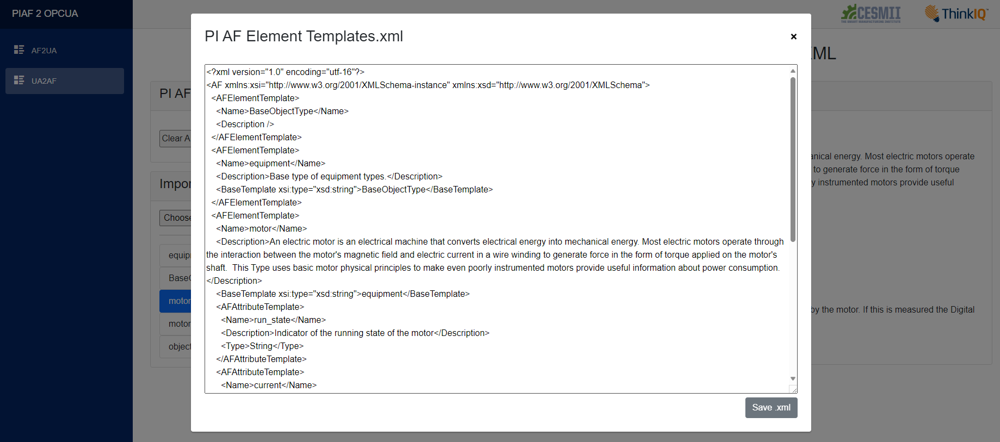
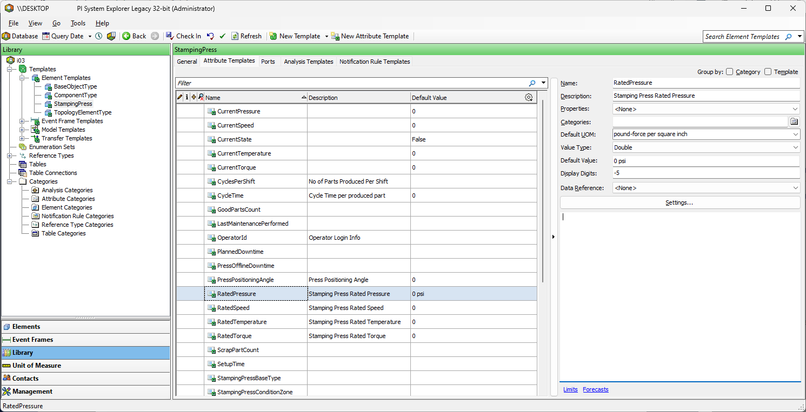

# Creating OPC UA Nodesets From Aveva PI Asset Framework Element Templates

This project leverages XML interoperability standards to allow creation of OPC UA Information Models, i.e. Nodesets, from Asset Framework (AF) Element Templates from AVEVA's PI System Explorer (PI AF). 

A program was created with a user interface to import and browse AF templates.

<b>Fig.1 - Screenshot of program UI: PI AF -> OPC UA</b>

The first step is to create a new UA Nodeset Model by entering a domain and name. The program automatically references the standard OPC UA namespace. 

Once a nodeset model is created, element templates can be added by using the "+" icons next to the element template names. Element templates can be removed from the model design the same way. Note, that if a template is based on another base template, that base template needs to be added to the OPC UA nodeset model first. At any time, one can preview and save the generated Nodeset xml file. 

<b>Fig.2 - Preview and Save Nodeset XML File</b>

## Modeling Techniques Supported in PI AF 

PI AF models include two basic types of objects: elements and attributes, both of which can be nested. Elements can be based on types, known as Element Templates, which are stored in a model library’s “Element Templates” section. An Element Template can be based on another Element Template. This allows inheritance and chaining of dependencies.

Even though element instances can be nested, element templates cannot be nested in PI AF. This means it is not possible to create composite types. However, within an element template, attribute templates can be nested. In this itteration of the translation tool, nested attributes are ignored.

## OPC UA Information Model Assumptions

Objects can be added into a newly created namespace. At this time, appending or editing of existing Information Models or Nodesets is not supported. The workflow builds an OPC UA nodeset model using the [Cesmii OPC UA Nodeset Utilities C# SDK](https://github.com/cesmii/CESMII-NodeSet-Utilities).

The following basic features of the OPC UA namespace are used to capture AF Element Templates:

- Element Templates are modeled as BaseObjectType.
- Element Templates that are based on another Element Template are modeled the same way. Thus, it is required to work from the bottom up, meaning that templates are only allowed to be added to an Information Model once the dependency exists.
- Attribute Templates are modeled either as BaseDataVariableType or as PropertyType.
- Static string attributes are modeled as Properties.
- Time series attributes and numeric attributes are modeled as variables, so engineering units can be attached.
- Engineering Units are captured in a property called "EngineeringUnits" based on the EUInformation type, which leverages the UNICE library of engineering units. If the DefaultUoM doesn't match, an exception message is shown.
- Since AF does not allow nested element types, it is not possible to create complex types that encapsulate nameplate metadata such as the MachineIdentificationType.
- The modeling rule of all properties and variables is set to its default state.

## Validation of created OPC UA Information Models

The OPC UA modeling tool UaModeler by Unified Automation was used to validate compatibility of created nodeset xml files.

<b>Fig.3 - Validation of Nodeset XML File</b>

# Creating Aveva PI Asset Framework Element Templates From OPC UA Nodesets

The project utilizes the same techniques discribed above to parse OPC UA Information Models, i.e. Nodesets, and create from them Asset Framework (AF) Element Templates for AVEVA's PI System Explorer (PI AF). 

<b>Fig.4 - Screenshot of program UI: OPC UA -> PI AF</b>

The first step is to load an existing OPC UA Nodeset xml file. The program resolves and loads other referenced namespaces if they are available at the web application's location. Nodeset XML files can be added as needed. 

Once a nodeset model is loaded, object types can be added by using the "+" icons next to the object type names. Object types can be removed from the model the same way. Note, that if an object type is based on another object type, that base reference needs to be added to the translation model first. At any time, one can preview and save the generated PI AF xml file. 

<b>Fig.5 - Preview and Save Nodeset XML File</b>

## Validation of created PI AF Library Files

Aveva's PI System Explorer was used to validate compatibility of created library xml files.

<b>Fig.6 - Validation of PI AF Library XML File</b>

